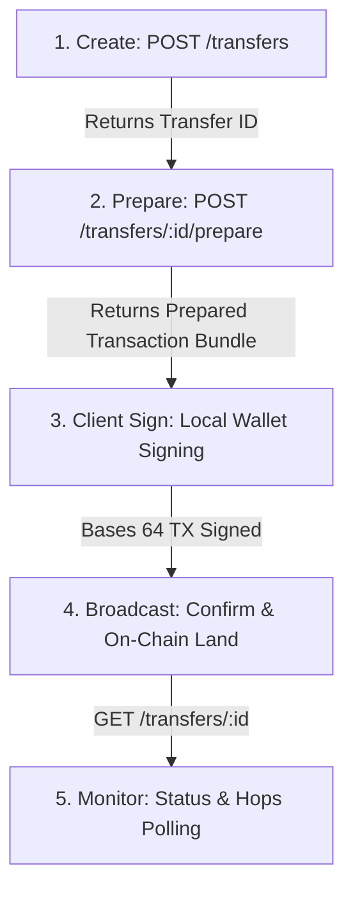

# MultiHopper Agentic Flow — Bug Bounty Harness

Testing suite for the [MultiHopper Superteam Earn Bounty](https://earn.superteam.fun).
This harness covers and tests the full agentic flow of the MultiHopper Solana routing API: **create → prepare → sign → confirm-broadcast → monitor**.

The harness performs standard verification tests, boundary analyses, and spawns an autonomous LLM-driven adversarial Red-Teaming agent to uncover high-impact vulnerabilities.

---

## Table of Contents
1. [Architectural Overview](#architectural-overview)
2. [Tested Vulnerability Classes](#tested-vulnerability-classes)
3. [Project Structure](#project-structure)
4. [Credentials & Configuration](#credentials--configuration)
5. [Getting Started](#getting-started)
6. [Detailed Command Reference](#detailed-command-reference)
7. [AI Red-Teaming (Oracle Mode)](#ai-red-teaming-oracle-mode)
8. [Submission Framing & Severity Discipline](#submission-framing--severity-discipline)

---

## Architectural Overview

MultiHopper is a multi-hop transfer and liquidity routing system. Its REST API is queried by autonomous agents to swap and route assets through various on-chain states. A complete transaction workflow is divided into five phases:



### The Transaction Bundle Invariant
A prepared transaction bundle from `/prepare` consists of up to four types of transactions:
1. `keeperFundingTx`: Funded by the user to pay fees to execution keepers.
2. `routeInitTxs[]`: Sets up route state accounts.
3. `orchestratorInitTx`: Prepares the core route logic account.
4. `sessionInitTxs[]`: Authorizes and schedules swap hops.

**Strict Broadcast Order:**
$$keeperFundingTx \longrightarrow routeInitTxs \longrightarrow orchestratorInitTx \longrightarrow sessionInitTxs$$

---

## Tested Vulnerability Classes

This testing suite targets critical security assumptions, boundary cases, and documentation traps:

### 1. Signature Verification & Binding Invariants
* **Fabricated Signatures:** Verifies that the `confirm-broadcast` endpoint rejects bogus or unconfirmed signatures.
* **Wrong Cardinality & Order:** Validates that route and session signatures are validated in the exact length and index order prepared.
* **Replay Invariants:** Asserts that transaction signatures from one transfer ID cannot be re-used to confirm or advance a different transfer ID.
* **Pre-prepared State Enforcement:** Ensures that calling `confirm-broadcast` before a `/prepare` call fails with an invalid state error rather than format validation success.

### 2. Idempotency & Concurrency Hazards
* **Idempotency-Key Header:** Enforces that mutations require a unique header.
* **Conflicting Requests (`MH_071`):** Asserts that reusing the same `Idempotency-Key` with a different request body returns a Conflict (`409` code `MH_071`).
* **Concurrent Races (`MH_072`):** Tests lock contention on concurrent duplicate requests, verifying `MH_072` returns properly.
* **Prepare Cache Consistency:** Verifies that repeating `/prepare` with the same `Idempotency-Key` replays identical transaction messages.

### 3. State Machine & Expiry Resumes
* **Blockhash Expiration:** Asserts that calling `/prepare` after the 60-second Solana blockhash TTL returns a fresh bundle with a new recent blockhash.
* **Resume & Recovery:** Verifies that after partial routes are successfully broadcast and confirmed, subsequent `/prepare` calls correctly mark on-chain confirmed sections as `null`.

### 4. Agent Documentation Hazards
* **TS Partial Signature Destruction:** Documents web3.js `VersionedTransaction.sign([keypair])` hazard where client-side signing replaces the entire signature array, zeroing out pre-signed server keeper/orchestrator slots.
* **Missing Fee Estimates:** Probes whether `/estimate` omits the mainnet compliance screening fee, causing agents using it to under-fund source wallets.

---

## Project Structure

* **`src/`**
  * [`client.py`](file:///c:/Users/SAMUEL/Desktop/SAMUEL/Hackathon/multihopper-bounty/src/client.py): A typed python client wrapper executing queries on the MultiHopper endpoints.
  * [`signer.py`](file:///c:/Users/SAMUEL/Desktop/SAMUEL/Hackathon/multihopper-bounty/src/signer.py): Low-level signing helper for both Legacy (orchestrator) and V0/Versioned (keeper, route, session) transactions, ensuring server pre-signatures are preserved.
  * [`findings.py`](file:///c:/Users/SAMUEL/Desktop/SAMUEL/Hackathon/multihopper-bounty/src/findings.py): Finding dataclass definition and markdown compilation engine.
  * [`harness.py`](file:///c:/Users/SAMUEL/Desktop/SAMUEL/Hackathon/multihopper-bounty/src/harness.py): The main automated test harness. Runs sequential validation, edge cases, and client-side integration probes.
  * [`agent.py`](file:///c:/Users/SAMUEL/Desktop/SAMUEL/Hackathon/multihopper-bounty/src/agent.py): Simulates a complete agent's operational cycle from creation to final polling, assessing real integration friction.
  * [`ai_red_team.py`](file:///c:/Users/SAMUEL/Desktop/SAMUEL/Hackathon/multihopper-bounty/src/ai_red_team.py): The LLM adversarial agent loop. Generates test payloads using Gemini/Gemma models.
  * [`poc_probe.py`](file:///c:/Users/SAMUEL/Desktop/SAMUEL/Hackathon/multihopper-bounty/src/poc_probe.py): Target proof-of-concept builder that constructs exploits for specific boundary-check violations.
  * [`oracle_scenarios.py`](file:///c:/Users/SAMUEL/Desktop/SAMUEL/Hackathon/multihopper-bounty/src/oracle_scenarios.py): Defines structured multi-step testing scenarios executed by the Red-Team loop or manual testing commands.
  * [`evidence_index.py`](file:///c:/Users/SAMUEL/Desktop/SAMUEL/Hackathon/multihopper-bounty/src/evidence_index.py): Reads existing findings and targets list to prevent the LLM agent from performing duplicate queries.
  * [`redaction.py`](file:///c:/Users/SAMUEL/Desktop/SAMUEL/Hackathon/multihopper-bounty/src/redaction.py): Sanitizes logs and reports by fingerprinting private keys and API credentials with SHA-256 hash digests.
* **`scripts/`**
  * [`run_all.py`](file:///c:/Users/SAMUEL/Desktop/SAMUEL/Hackathon/multihopper-bounty/scripts/run_all.py): Master orchestrator coordinating all phases, building a consolidated report.
  * [`run_scenario.py`](file:///c:/Users/SAMUEL/Desktop/SAMUEL/Hackathon/multihopper-bounty/scripts/run_scenario.py): Command line utility to target and run a single named test scenario.
  * [`summarize_evidence.py`](file:///c:/Users/SAMUEL/Desktop/SAMUEL/Hackathon/multihopper-bounty/scripts/summarize_evidence.py): Gathers findings across intermediate reports to index them in `reports/evidence_index.md`.
* **`tests/`**
  * [`test_idempotency.py`](file:///c:/Users/SAMUEL/Desktop/SAMUEL/Hackathon/multihopper-bounty/tests/test_idempotency.py): Tests `Idempotency-Key` behaviors.
  * [`test_validation.py`](file:///c:/Users/SAMUEL/Desktop/SAMUEL/Hackathon/multihopper-bounty/tests/test_validation.py): Input validations (hops, arrivalSeconds, wallets, token mints).
  * [`test_broadcast_flow.py`](file:///c:/Users/SAMUEL/Desktop/SAMUEL/Hackathon/multihopper-bounty/tests/test_broadcast_flow.py): Invariant testing on the confirm-broadcast state machine.
  * [`test_signing.py`](file:///c:/Users/SAMUEL/Desktop/SAMUEL/Hackathon/multihopper-bounty/tests/test_signing.py): Local signing helper unit and integration tests.
  * [`test_status_polling.py`](file:///c:/Users/SAMUEL/Desktop/SAMUEL/Hackathon/multihopper-bounty/tests/test_status_polling.py): GET status polling invariants.
  * [`test_adversarial.py`](file:///c:/Users/SAMUEL/Desktop/SAMUEL/Hackathon/multihopper-bounty/tests/test_adversarial.py): Target adversarial scenarios asserting security parameters.
  * [`test_full_flow.py`](file:///c:/Users/SAMUEL/Desktop/SAMUEL/Hackathon/multihopper-bounty/tests/test_full_flow.py): Standard transaction broadcast testing.

---

## Credentials & Configuration

Copy [`.env.example`](file:///c:/Users/SAMUEL/Desktop/SAMUEL/Hackathon/multihopper-bounty/.env.example) to `.env` and fill out the fields:

```bash
cp .env.example .env
```

| Env Variable | Description | Default |
|---|---|---|
| `MH_API_KEY` | Developer API key (`mh_test_...` or `mh_live_...`) | *Required* |
| `MH_API_BASE` | MultiHopper API base URL | `https://devnet.multihopper.com` |
| `SOURCE_WALLET` | Your funded Solana wallet address | *Required* |
| `RECIPIENT_WALLET`| Recipient Solana wallet address | *Required* |
| `SOLANA_PRIVATE_KEY`| The base58 private key of your `SOURCE_WALLET` | *Required (for signing)* |
| `SOLANA_RPC_URL` | Solana node RPC endpoint | `https://api.devnet.solana.com` |
| `MH_ENABLE_SLOW_PROBES`| Set to `1` to run tests waiting for blockhash expiry | `0` |
| `MH_ORACLE_TURNS` | Number of steps the autonomous Red-Team agent takes | `12` |
| `GEMINI_API_KEY` | Google Gemini API key (for Red-Team Oracle model) | *Optional* |
| `GROQ_API_KEY` | Groq API key (fallback for Red-Team Oracle model) | *Optional* |

---

## Getting Started

1. **Activate Environment & Install Dependencies:**
   ```powershell
   python -m venv venv
   # Activation:
   # Windows:
   .\venv\Scripts\activate
   # Linux/macOS:
   source venv/bin/activate

   pip install -r requirements.txt
   ```
   *Note: Client-side signing tests require `solders` and `base58` (included in `requirements.txt`).*

2. **Run Pytest Suite:**
   ```powershell
   python -m pytest tests/ -v
   ```

---

## Detailed Command Reference

### Master Orchestrator: `run_all.py`
Run the complete testing suite (harness, deep probes, PoC probes, AI oracle, and index summary). Generates a combined markdown report at `reports/submission_report.md`.

```powershell
python scripts/run_all.py [options]
```

* **Options:**
  * `--oracle-turns N`: Number of loops the AI Red-Team runs (default: `12`).
  * `--skip-oracle`: Skip the AI Red-Teaming phase.
  * `--skip-poc`: Skip running the PoC boundary probes.
  * `--slow-expiry`: Include the blockhash expiry scenario which sleeps for 75 seconds to verify route regeneration.
  * `--keep-intermediate`: Retain individual intermediate report files in `reports/` instead of removing them.

### Single Scenario execution: `run_scenario.py`
Executes one individual multi-step test flow defined in [`oracle_scenarios.py`](file:///c:/Users/SAMUEL/Desktop/SAMUEL/Hackathon/multihopper-bounty/src/oracle_scenarios.py):

```powershell
python scripts/run_scenario.py <scenario_name> [args]
```

**Available Scenarios:**
* `idempotency_conflict_mh071`: Tests same-key, conflict payload error.
* `concurrent_same_key`: Tests same-key race condition handling.
* `confirm_wrong_cardinality`: Asserts signature list mismatches.
* `confirm_route_before_keeper`: Tests broadcast ordering enforcement.
* `confirm_before_prepare_valid_sigs`: Verifies state state transitions prior to `/prepare`.
* `prepare_retry_consistency`: Asserts identical blockhash/tx outputs on retry.
* `prepare_after_expiry`: Triggers blockhash expiration sequence.

---

## AI Red-Teaming (Oracle Mode)

The script [`ai_red_team.py`](file:///c:/Users/SAMUEL/Desktop/SAMUEL/Hackathon/multihopper-bounty/src/ai_red_team.py) runs an autonomous AI tester that uses LLM models (Gemini/Groq) to explore API gaps.

1. **Context Loading:** Reads existing reports in `reports/` and maps them using [`evidence_index.py`](file:///c:/Users/SAMUEL/Desktop/SAMUEL/Hackathon/multihopper-bounty/src/evidence_index.py).
2. **Prioritization:** Instructs the LLM about covered bugs and directs it to investigate open areas listed under `PRIORITY_GAPS`.
3. **Execution Loop:** The LLM decides on an action (client calls, raw POSTs, or scenario executions). The system returns the raw HTTP status and JSON response for the LLM to inspect in the next turn.
4. **Scrubbing:** All logs and traces written to `reports/ai_oracle_trace.jsonl` redact secrets.

---

## Submission Framing & Severity Discipline

All reports parsed by this harness follow a rigorous severity calibration standard:

* **Critical:** Confirmed live credential-value leakage, unauthorized withdrawals/fund drain, cross-tenant access, or RCE.
* **High:** Logic bypasses leading to state corruption, signature array invalidation that could block active routing, or crash/KeyError paths in the agentic flow.
* **Medium/Low:** API schema mismatches, validation failures (e.g. invalid wallets accepted but failing on-chain), or minor typos.
* **Documentation:** Typographic errors, omissions of crucial fees, or missing replay protection details.

The final consolidated report is compiled at `reports/submission_report.md`, ready for bounty submission.
